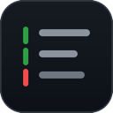

<p align="center">
  
</p>

<h1 align="center">CSP Coverage</h1>

<p align="center">
  Live test-coverage gutters in VS Code, powered by the
  <a href="https://github.com/decentparadox/csp">Coverage Server Protocol</a>.<br/>
  One editor UI — Rust, Go, TypeScript, and anything that emits lcov.
</p>

<p align="center">
  
  
  
</p>

---

CSP is to **test quality** what LSP is to language intelligence. This extension is
a reference CSP **client**: it launches a `csp-server` over stdio and paints what
the server reports straight into the editor — no manual coverage step, no
language-specific plugin.

## Features

- 🟩🟥 **Coverage gutters** — continuous green/red bars (Git dirty-diff style) mark
  covered and uncovered lines. Hover a bar to see the hit count.
- 🩶 **Stale markers** — edit a covered file and its bars turn grey until the next
  run, so green gutters never lie.
- 🧪 **Status-bar coverage** — workspace line-coverage percentage, colored by level,
  with a click-through action menu.
- 🔍 **Quality diagnostics** — uncovered lines surface in the Problems panel.
- ♻️ **Refresh on demand** — a toolbar/command action re-runs collection.
- 🌐 **Language-agnostic** — Rust (`cargo-llvm-cov`), Go (`go test -coverprofile`),
  JS/TS (Istanbul/vitest), or any `lcov.info`. The server auto-detects.

## How it works

```
 csp-server  ──stdio JSON-RPC──▶  CSP Coverage (this extension)
   publishCoverage            ▶   green / red gutter bars
   publishQualityDiagnostics  ▶   Problems panel
   runStateChanged.summary    ▶   status bar  "✓ 72%"
 didOpen / didChange          ◀   grey (stale) bars after edits
 run                          ◀   "Refresh Coverage" action
```

On activation the extension starts one `csp-server` per workspace folder, runs the
CSP lifecycle (`initialize` → `initialized`), and listens. The server auto-collects
coverage and pushes one update per file. URIs are matched by decoded filesystem
path, so percent-encoding or path normalisation never breaks the mapping.

## Requirements

A `csp-server` binary. The extension finds one in this order:

1. The `csp.serverPath` setting.
2. `<workspace>/target/{release,debug}/csp-server`.
3. `<csp-repo>/target/{release,debug}/csp-server`.
4. `csp-server` on `PATH`.

Build the reference server with `cargo build -p csp-server --release`.

## Settings

| Setting             | Default  | Description                                                        |
| ------------------- | -------- | ------------------------------------------------------------------ |
| `csp.serverPath`    | `""`     | Path to `csp-server`; empty = auto-discover.                        |
| `csp.framework`     | `"auto"` | Force an adapter: `cargo-llvm-cov` / `go` / `istanbul` / `lcov`.   |
| `csp.enableGutters` | `true`   | Render covered/uncovered gutter bars.                              |
| `csp.noAutorun`     | `false`  | Set `CSP_NO_AUTORUN`: report an existing artifact, don't run tests. |

## Commands

All under the **CSP** category (⇧⌘P):

- **CSP: Refresh Coverage** — re-collect now.
- **CSP: Toggle Coverage Gutters**
- **CSP: Restart Coverage Server**
- **CSP: Show Server Log**

## Develop

```sh
npm install
npm run build          # or: npm run watch
```

Press **F5** to launch an Extension Development Host against `examples/go-sample`.

## Limitations

- If a workspace is opened through a symlink, the server's paths may differ from
  the editor's; coverage for those files won't attach.
- The status bar reflects the most recent folder's workspace summary.

## License

[MIT](LICENSE)
